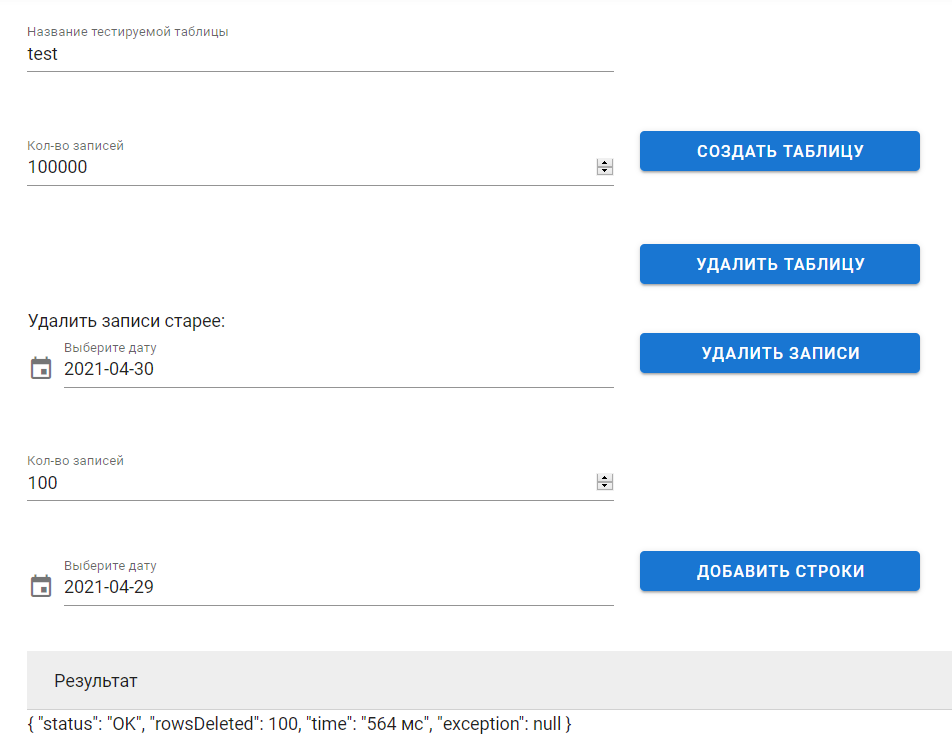

# delete_rows
Реализовать API с использованием которое позволит удалять данные из реляционной БД  таблиц объемом 10 млн строк и более. Ключ, по которому производится удаление данных, столбец DateTime (удаляем старые данные). Работа системы не должна приводить к длительным блокировкам данных. АPI может вызываться несколькими внешними процессами одновременно. (1 процесс удаляет данные в 1 таблице). Необходимо обеспечить логирование работы API.  

## Описание проекта

-----------------------------------
Приложение удаляет записи из таблицы, дата создания которых меньше указанной в запросе.

В зависимости от количества удаляемых строк от общего количества строк в таблице, приложение определяет стратегию удаления.

Реализовано 3 стратегии удаления записей:

**InsertRemoveStrategy** - удаление через вставку нужных строк в новую таблицу;

**PartitionRemoveStrategy** - порционное удаление записей;

**TruncateRemoveStrategy** - полная очистка таблицы;

### Запуск

Используется __Java__, __PostgreSQL__ сервер, __Vue.js__. Для запуска выполнить команду

```sh
mvn clean spring-boot:run
```

### Переменные окружения

| Название | Пример и значение по умолчанию | Описание |
| --- |------- | ------ |
| PG_URL | jdbc:postgresql://localhost:5432/db | Адрес PostgreSQL |
| PG_USER | postgres | Имя пользователя БД |
| PG_PASSWORD | postgres | Пароль пользователя БД |

### Использование

После запуска будет доступен web страница по адресу http://localhost:8080



и REST сервис по адресу http://localhost:8080/api

| EndPoint | HTTP-метод | Переменные запроса | Описание |
| --- |------- | ------ |------ |
| /new_table |POST | table,length |Создать таблицу с именем __table__ и сгенерировать __length__ записей |
| /insert_rows |POST | table,date,length |Добавить в таблицу __table__ количество записей __length__ за дату __date__|
| /drop_table |POST | table |Удалить таблицу с именем __table__ |
| /delete |POST | table,fromDate |Удалить из таблицы с именем __table__ записи старее __fromDate__.|

### Примеры

Создание таблицы t1 с 10000 записями

````shell script
curl -X POST -F 'table=t1' -F 'length=10000' http://127.0.0.1:8080/api/create_table

----log----
Создание таблицы t1 c длиной 10000
Время выполнения: 496 мс
````

Удаление таблицы t1

````shell script
curl -X POST -F 'table=t1' http://127.0.0.1:8080/api/drop_table

----log----
Запуск таймера
Удаление таблицы t1
Время выполнения: 20 мс
````

Удаление из таблицы t1 записи старее 2121-01-01

````shell script
curl -X POST -F 'table=t1' -F 'fromDate="2121-01-01"' http://127.0.0.1:8080/api/delete
````
